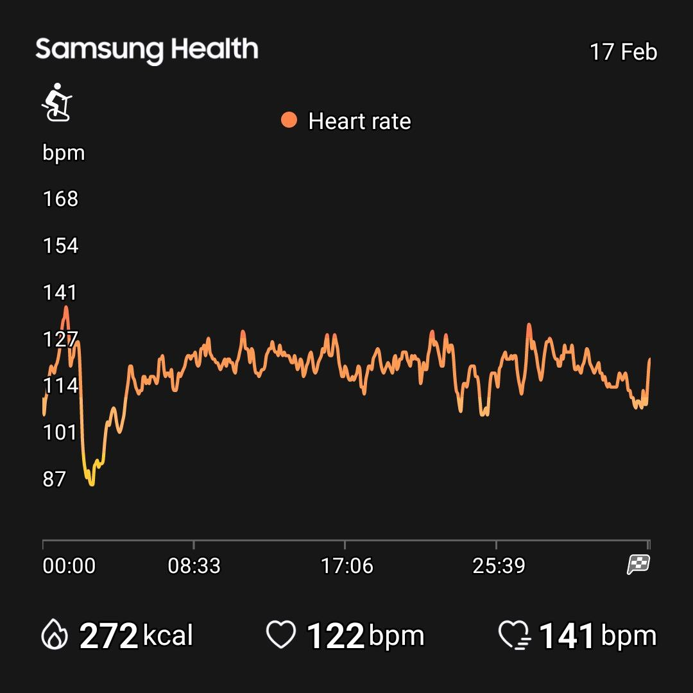

# Training Log 2026

## Format
| Date | Type | Duration | Session | Feel (1-10) | Notes |
|------|------|----------|---------|-------------|-------|
| 17 Feb 2026 | Zone 2 Cycling (Indoor) | 32:16 | 12.22 km @ 23.1 km/h, 127bpm, 85rpm | - | Knee pain minimal at seat height 14. Warm-up 5min, cool-down 2min. |

## Session Details

### Zone 2 Cycling - 17 Feb 2026
- **Time:** 12:18
- **Duration:** ~39 minutes (5min warm-up + 32:16 ride + 2min cool-down)
- **Distance:** 12.22 km
- **Speed:** 23.1 km/h avg
- **HR:** Avg 127 bpm (capped at 125)
- **Cadence:** 85 rpm
- **Seat Height:** 14
- **Pain:** Minimal knee discomfort
- **Proof:** 

### Insights
- Good HR compliance - stayed in Zone 2
- Knee pain minimal - seat height 14 seems manageable
- Cadence 85 is good - consistent and efficient
- 12.22 km in 32 min = ~23 km/h avg speed

### Recommendations
- Monitor knee if it persists - might want to try seat height 13 or 15
- Consider slight cadence increase (88-90) if aiming for more speed
- Great baseline session to build from
